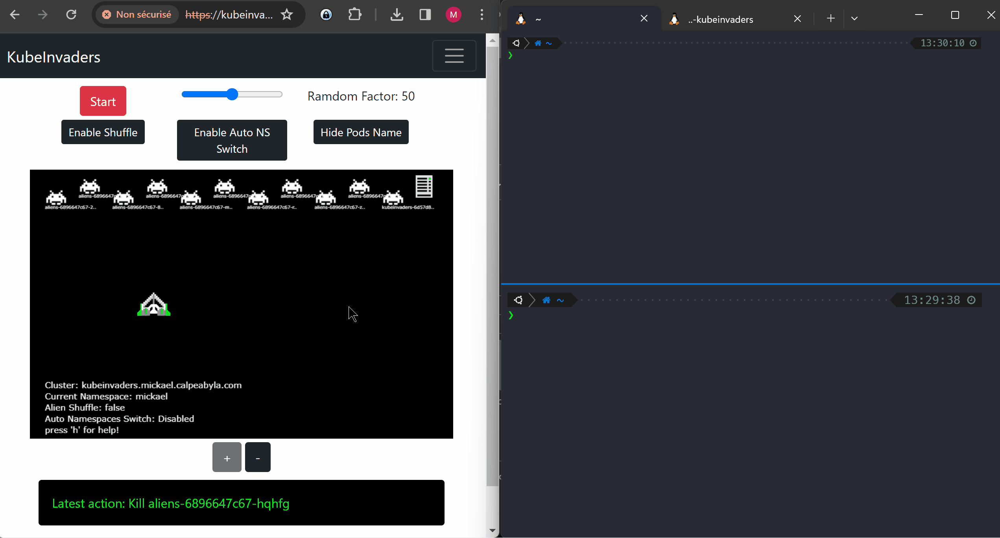

# TP #1 (kubeinvaders)

## instructions de déploiement

Voici les commandes à exécuter pour déployer les différents composants:

```bash
kubectl apply -f .
```

## démonstration de fonctionnement

Ci-dessous un visuel qui démontre:

1. qu'à l'état initial, l'application `kubeinvaders` est fonctionnelle (panneau de gauche), les pods des applications `aliens` et `kubeinvaders` sont en cours d'exécution (panneau en haut à droite) et que l'application `aliens` est accessible (panneau en bas à droite)
2. que les `pods` qui sont supprimés au fur & à mesure qu'on utilise `kubeinvaders` sont effectivement détruits puis recréés
3. que pendant toute la durée de cette opéation, l'application `aliens` reste accessible malgré la disparition de certains des `pods` qui la constituent



## desinstallation

Voici les commandes à exécuter pour desinstaller les différents composants:

```bash
kubectl delete -f .
```
