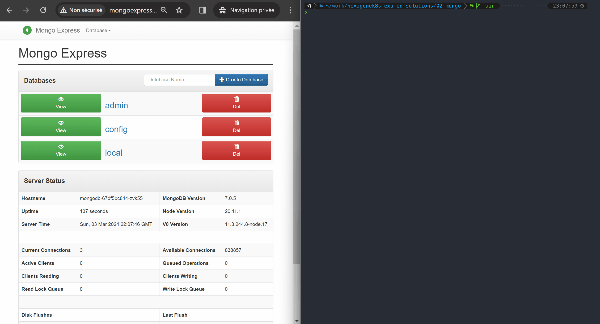
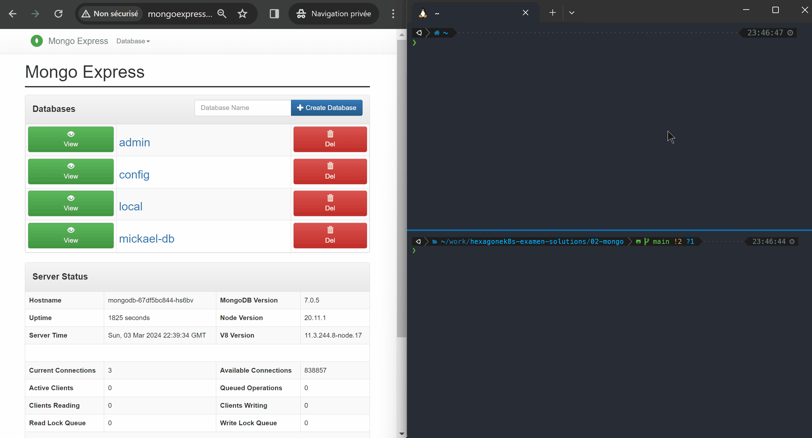

# TP #2 (mongo-db & mongo-express)

## instructions de déploiement

Voici les commandes à exécuter pour déployer les différents composants:

```bash
kubectl apply -f 01-secret.yaml -f 02-configmap.yaml -f 03-pvc.yaml -f 04-mongo-db.yaml
kubectl wait --for=condition=Ready --timeout=120s pod -l app=mongodb
kubectl apply -f 05-mongo-express.yaml
```

## explication des principaux éléments

- l'utilisation de `secrets` et `configMaps` permet d'éviter d'écrire en dur des informations au sein d'objets comme des `deployments`
- dans le cas présent, l'utilisation de `secrets` permet également de centraliser certaines informations qui seront utilisées dans plusieurs `deployments` et ainsi minimiser les risques d'erreurs
- l'utilisation d'attributs `resources` est nécessaire pour controler les quantités de CPU et mémoire allouées aux différents conteneurs des `pods`
- les attributs `livenessProbe` et `readinessProbe` sont nécessaires pour s'assurer que Kubernetes sera en mesure de détecter si les `pods` sont en bonne santé et si du trafic peut leur être envoyé
- le `hpa` associé au `deployment` mongo-express permet de garantir que la 'taille' de ce composant s'ajuste à la quantité d'utilisateurs qui y accèdent.  
  :bulb: je ne mets pas de `hpa` sur la partie mongo-db car ce composant n'est pas conçu pour fonctionner en plusieurs exemplaires
- l'utilisation de `pdb` pour les 2 composants mongodb et mongo-express garantit qu'ils resteront disponibles même dans l'éventualité d'une opération de maintenance qui nécessiterait l'arrêt de certains noeuds du cluster Kubernetes

## vérification du fonctionnement de l'application `mongo-express`

### résilience de la base mongodb

Ci-dessous un visuel qui démontre:

1. qu'à l'état initial, l'application mongo-express est fonctionnelle (panneau de gauche), et que les `pods` de l'ensemble des composants sont en cours d'exécution (panneau de droite)
2. qu'on peut créer du contenu dans la base mongodb en utlisant l'application mongo-express
3. qu'après avoir supprimé le `pod` faisant tourner la base mongodb, le contenu de la base mongodb est toujours présent. Cela démontre l'intérêt de l'utilisation de `pvc`



### fonctionnement du `hpa`

Pour montrer le fonctionnement des `hpa` on peut démarrer l'application, regarder le nombre de `replicas` en fonctionnement et générer de la charge. Au bout d'un moment le nombre de `replicas` doit augmenter automatiquement.  
On peut également surveiller la consommation cpu & mémoire utilisée par chaque `pod` avec la commande `kubectl top pods`.  
Enfin, on peut obtenir les principales information du `hpa` avec la commande `kubectl get hpa`.  

L'annimation ci-dessous montre le bon fonctionnement du `hpa`.  



### fonctionnement des 'probes'

A ce stade aucune démonstration particulière ne vous était demandée au sujet du fonctionnement des 'probes' si ce n'est que de bien vérifier que les `pods` étaient en état de fonctionnement stable après la mise en place de ces 'probes'.  
Ici un simple `kubectl get pods` mettant en évidence le nombre de 'restarts' faible et le status 'ready' des `pods` suffisait donc.

```bash
❯ kubectl get pods
NAME                             READY   STATUS    RESTARTS   AGE
mongo-express-7f7b7f95db-t5j76   1/1     Running   0          66m
mongodb-67df5bc844-vwqs6         1/1     Running   0          71m
```

Je vous laisse lire les fichiers yaml pour voir l'ensemble des détails, mais sinon, voici les principaux éléments:  

#### mise en oeuvre des probes pour `mongo-db`

2 types de probes `liveness` pouvaient être utilisées:  

1- `tcpSocket` en ciblant le port d'écoute de mongo-db, c'est-à-dire le port `27017`:  

   ```yaml
   livenessProbe:
     tcpSocket:
       port: 27017
     initialDelaySeconds: 0
     periodSeconds: 10
     timeoutSeconds: 1
   ```

2- `exec` et en utilisant le CLI `mongosh` présent dans l'image mongo utilisée:  

   ```yaml
   livenessProbe:
     exec:
       command:
       - mongosh
       - --eval "db.adminCommand('ping')"
     initialDelaySeconds: 5
     periodSeconds: 10
     timeoutSeconds: 5
   ```

#### mise en oeuvre des probes pour `mongo-express`

Ici, il fallait utiliser une probe de type `httpGet`.  
:fire: Puisque l'application met en oeuvre une authentification de type Basic, il faut penser à véhiculer un header http dans la définition de la probe faute de quoi le probe reçoit un code retour http "401 Unauthorized".  

```yaml
livenessProbe:
  httpGet:
    path: /
    port: 8081
    httpHeaders:
    - name: "Authorization"
      value: "Basic ZXhwcmVzc3VzZXI6ZXhwcmVzc3Bhc3N3b3Jk"
  initialDelaySeconds: 30
  periodSeconds: 10
  timeoutSeconds: 5
```

:bulb: la valeur `ZXhwcmVzc3VzZXI6ZXhwcmVzc3Bhc3N3b3Jk` est la valeur encodée en base64 du nom d'utilisateur et du mot de passe (séparés par ':') utilisés pour s'authentifier à `mongo-express` (cf. [[01-secret.yaml]](01-secret.yaml))

## desinstallation

Voici les commandes à exécuter pour desinstaller les différents composants:

```bash
kubectl delete -f .
```
